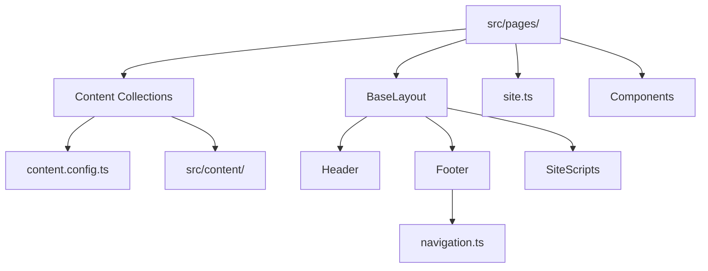

# Componentes

```mermaid
flowchart TD
 P["src/pages/"] --> C["Content Collections"]
 C --> Z["content.config.ts"]
 C --> J["src/content/"]
 P --> L["BaseLayout"]
 P --> U["site.ts"]
 P --> K["Components"]
 L --> H["Header"]
 L --> F["Footer"]
 L --> S["SiteScripts"]
 F --> N["navigation.ts"]
```
/auditoria usa documento HTML propio y manifiestos, sin BaseLayout.

Última revisión documental: 2026-09-16. Estado: reconstruido desde repositorio.
