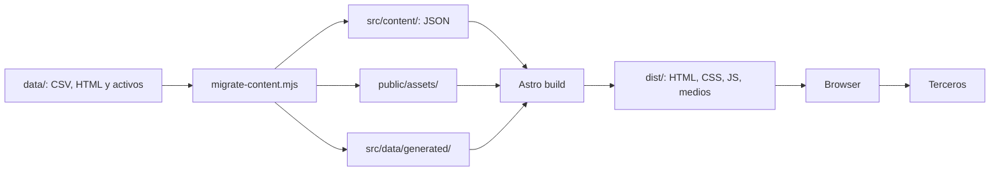

# Contenedores

```mermaid
flowchart LR
 D["data/: CSV, HTML y activos"] --> M["migrate-content.mjs"]
 M --> J["src/content/: JSON"]
 M --> A["public/assets/"]
 M --> F["src/data/generated/"]
 J --> B["Astro build"]
 A --> B
 F --> B
 B --> H["dist/: HTML, CSS, JS, medios"]
 H --> Browser
 Browser --> Terceros
```
Host, backend y DB: host no determinado; backend y DB no existen en el proyecto.

Última revisión documental: 2026-09-16. Estado: reconstruido desde repositorio.
