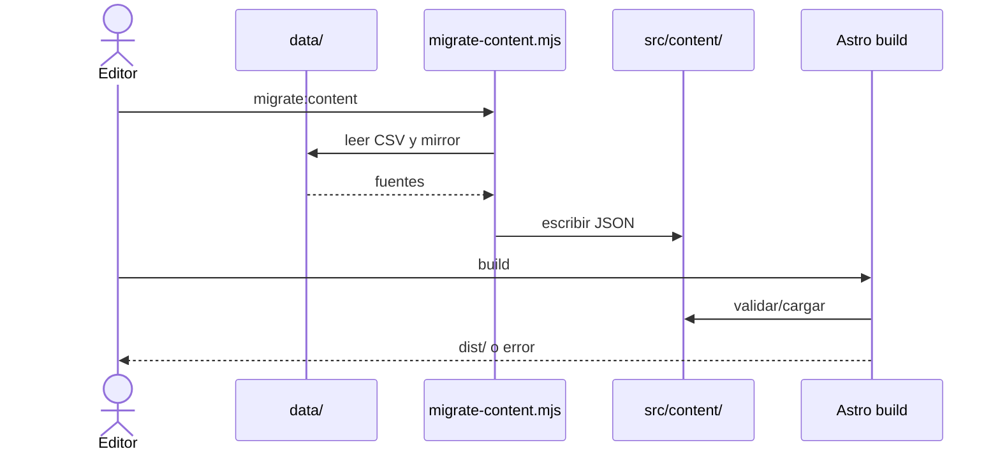
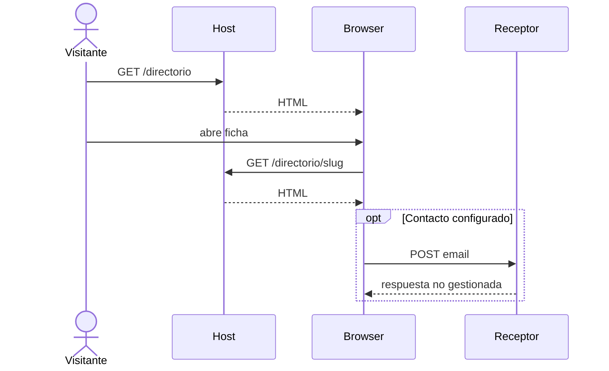

# Flujos

```mermaid
sequenceDiagram
 actor Editor
 participant D as data/
 participant M as migrate-content.mjs
 participant J as src/content/
 participant B as Astro build
 Editor->>M: migrate:content
 M->>D: leer CSV y mirror
 D-->>M: fuentes
 M->>J: escribir JSON
 Editor->>B: build
 B->>J: validar/cargar
 B-->>Editor: dist/ o error
```

```mermaid
sequenceDiagram
 actor Visitante
 participant Host
 participant Browser
 participant Receptor
 Visitante->>Host: GET /directorio
 Host-->>Browser: HTML
 Visitante->>Browser: abre ficha
 Browser->>Host: GET /directorio/slug
 Host-->>Browser: HTML
 opt Contacto configurado
  Browser->>Receptor: POST email
  Receptor-->>Browser: respuesta no gestionada
 end
```

Última revisión documental: 2026-09-16. Estado: reconstruido desde repositorio.
