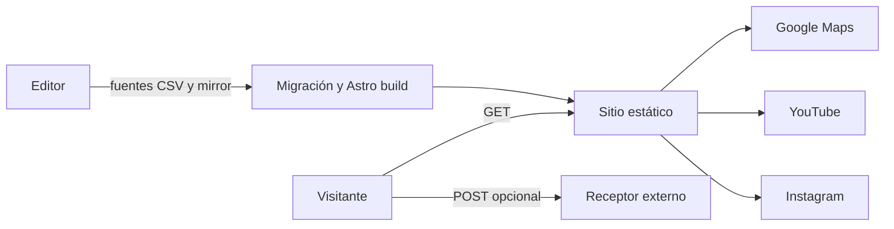

# Contexto

```mermaid
flowchart LR
 Editor -->|fuentes CSV y mirror| Build["Migración y Astro build"]
 Build --> Sitio["Sitio estático"]
 Visitante -->|GET| Sitio
 Sitio --> Maps["Google Maps"]
 Sitio --> YouTube
 Sitio --> Instagram
 Visitante -->|POST opcional| Contacto["Receptor externo"]
```
El POST sale directamente del navegador. Editor es actor operativo inferido, sin cuenta web.

Última revisión documental: 2026-09-16. Estado: reconstruido desde repositorio.
